# 代码设计思路

问题的核心是要遍历所有可能的注射剂量与注射次数的组合，并计算出对应的单次注射剂量。下面是设计思路的逐步分解：

## 1、数据结构设计

 	定义一个结构体，用于存储每种注射剂量的实际药液容量和对应的注射器容量。用于简化数据的管理，使得每个选项都包含了必要的信息。

## 2、生成注射剂量的组合

​	使用递归函数来生成所有可能的药液容量组合。使用经典的组合生成算法，通过递归的选择或不选择洗一个元素来构建所有可能的组合

## 3、组合的应用

​	在每次递归达到基本情况时，在程序中遍历10到180的注射次数，计算并输出每种组合在不同注射次数下的单次注射剂量。

## 4、主函数逻辑

​	在main函数中，首先定义了一个包含所有可能注射剂量选项的向量。然后，通过一个循环，从1到5，调用函数来生成所有从5中注射剂量选项中选择r个的组合。

# 运行截图

## 1、同时选择一种注射剂量

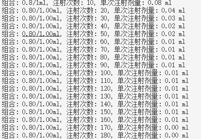

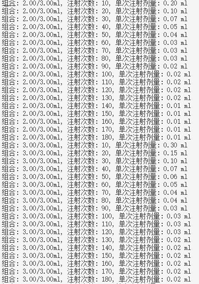

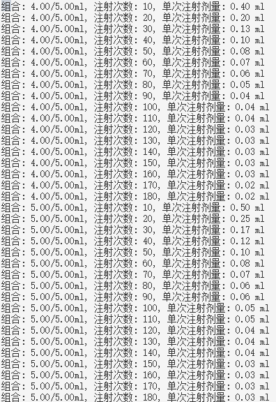

## 2、同时选择二种注射剂量

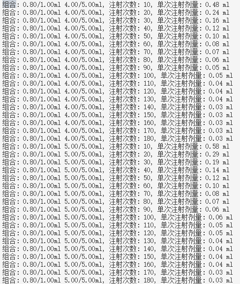

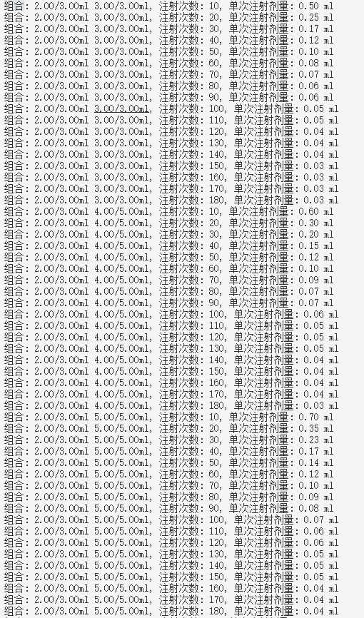

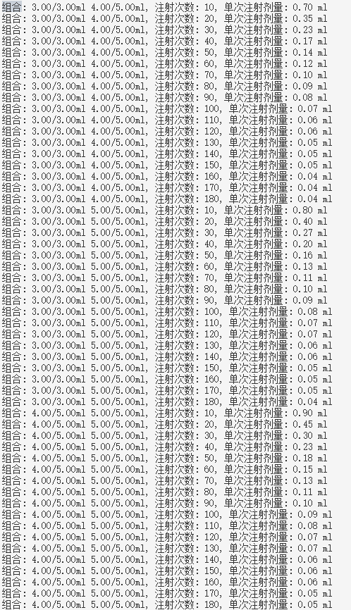

## 3、同时选择三种注射剂量

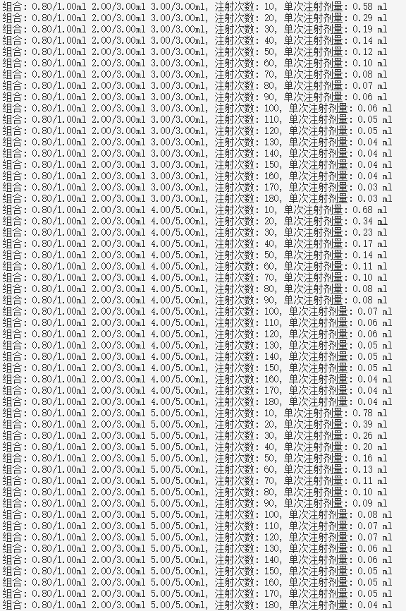

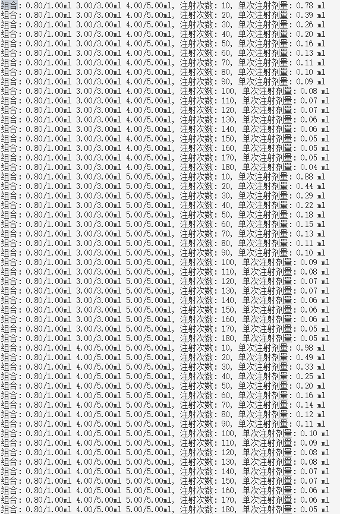

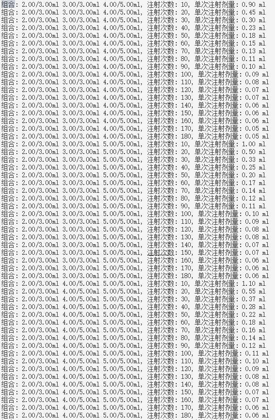

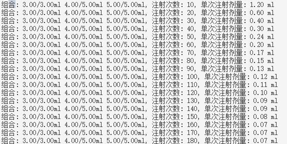

## 4、同时选择四种注射剂量

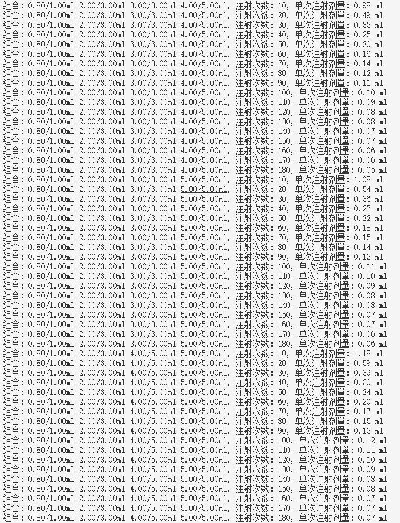

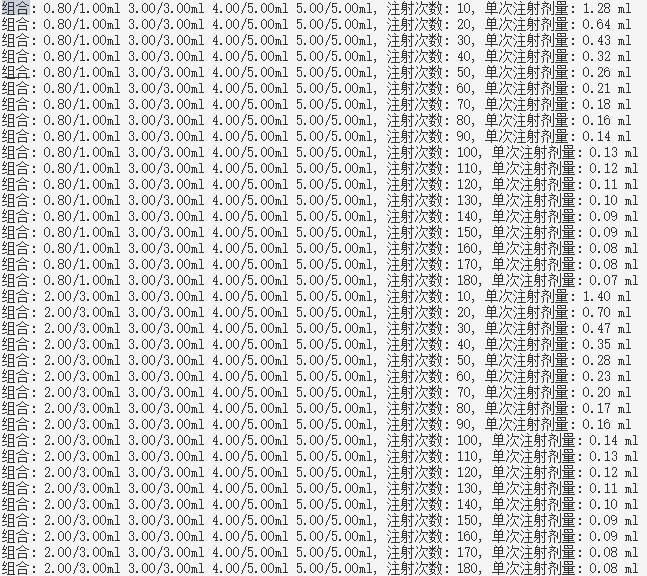

## 5、同时选择五种注射剂量

